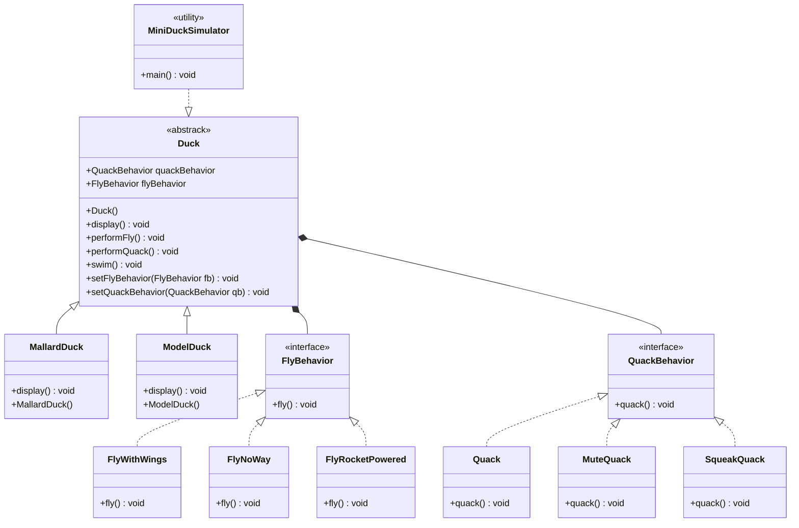

## introduction

## implement

```mermaid
classDiagram
MiniDuckSimulator ..|> Duck
Duck <|-- MallardDuck
Duck <|-- ModelDuck
Duck *-- FlyBehavior
Duck *-- QuackBehavior
FlyBehavior <|.. FlyWithWings
FlyBehavior <|.. FlyNoWay
FlyBehavior <|.. FlyRocketPowered
QuackBehavior <|.. Quack
QuackBehavior <|.. MuteQuack
QuackBehavior <|.. SqueakQuack

class MiniDuckSimulator{
    <<utility>>
    +main() void 
}
class Duck{
    <<abstrack>>
    +QuackBehavior quackBehavior
    +FlyBehavior flyBehavior
    +Duck()
    +display() void
    +performFly() void
    +performQuack() void
    +swim() void
    +setFlyBehavior(FlyBehavior fb) void
    +setQuackBehavior(QuackBehavior qb) void
}
class ModelDuck{
    +display() void
    +ModelDuck()
}
class MallardDuck{
    +display() void
    +MallardDuck()
}
class FlyBehavior{
    <<interface>>
    +fly() void
}
class FlyWithWings{
    +fly() void
}
class FlyNoWay{
    +fly() void
}
class FlyRocketPowered{
    +fly() void
}

class QuackBehavior{
    <<interface>>
    +quack() void
}
class Quack{
    +quack() void
}
class MuteQuack{
    +quack() void
}
class SqueakQuack{
    +quack() void
}
```

## conclusion
